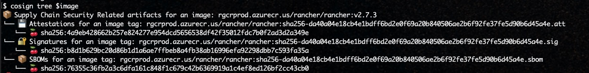
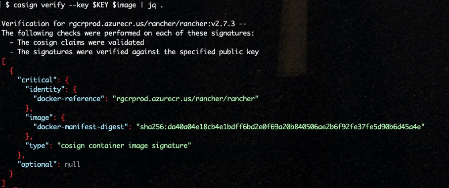

# Can I get chips for the SLSA with the Rancher Government Solution's Carbide?


[Rancher Government Solutions (RGS)](https://ranchergovernment.com/) is proud to announce Carbide. Carbide is a mix of a several advanced features to enhance Rancher's Multicluster Manager named [Rancher](https://www.rancher.com/products/rancher). The features include Offline Docs, a STIG Observability tool called Stigatron, and a Secure Software Supply Chain. We are going to focus on the Secure Software Supply Chain in this guide. Carbide is bringing Cryptographic Signatures and Software Bill of Materials (SBOMs) to a fully supported private container registry. Carbide's registry should be the **only** starting point for all the SUSE/Rancher products. Please check Github for the latest [Carbide docs](https://rancherfederal.github.io/carbide-docs/docs/intro) for more information. This guide will walk through some of the technical details about Carbide's Secure Software Supply Chain.

---

> **Table of Contents**:
>
> * [Technical and Mission Values](#technical-and-mission-values)
> * [What is an SBOMs and Attestations?](#what-is-an-sboms-and-attestations)
> * [What is a Secure Software Supply Chain?](#what-is-a-secure-software-supply-chain)
> * [Tooling](#Tooling)
> * [Validation and Inspection](#validation-and-inspection)
> * [Enforcement with Kubewarden](#enforcement-with-kubewarden)
> * [Air Gap-iness](#air-gap-iness)

---

## Technical and Mission Values

Before we get too technical, let's talk about value. The technical and mission value of a secure software supply chain cannot be overstated. A secure software supply chain ensures that software applications are developed, tested, and delivered with a focus on security and reliability. This means that the software is less vulnerable to attacks, less likely to fail, and more resilient in the face of cyber threats. A secure software supply chain also ensures that software is compliant with legal and regulatory requirements, reducing legal liabilities and reputational damage. Moreover, a secure software supply chain can help reduce costs and improve efficiency by eliminating potential security breaches and reducing the time and resources required to fix vulnerabilities. Overall, a secure software supply chain is essential for maintaining the technical and mission value of software applications, protecting critical infrastructure, sensitive data, and intellectual property, and ensuring customer satisfaction. Carbide is that foundation for a secure Kubernetes supply chain.

## What is an SBOMs and Attestations?

Let's first break down some of the Buzzword Bingo. At a high level:

* **Attestations** - Confirmation of Authenticity - Meaning the authenticity of the file/object can be verified through the signature and tooling.
* **Vulnerability Report** - List of the CVEs in the image. The Vulnerability Report is has uploaded to the Registry with the Signing Key. There is an Attestation of the Vulnerability Report.
* **Software Bill of Materials (SBOMs)** - A list of components in the image. Similar to the Vulnerability Report the SBOM is also a file that has can be authenticated. The SBOM is great for looking at the individual components in the image.
* **Signature** - Signature used to sign all the Attestations and Image. There is a basic Public/Private key pair usage. The public key for Carbide is published in a few places.

When thinking about how all these pieces fit together consider the objects as files. Each file has to be signed by a signature or multiple signatures. We can now leverage all the signatures and attestations as a foundation of a Secure Software Supply Chain.

## What is a Secure Software Supply Chain?

Thanks to [Chris DeRusha](https://www.cio.gov/about/members-and-leadership/derusha-chris/), Federal Chief Information Security Officer and Deputy National Cyber Director, for the [briefing](https://www.whitehouse.gov/omb/briefing-room/2022/09/14/enhancing-the-security-of-the-software-supply-chain-to-deliver-a-secure-government-experience/) on the [Executive Order (EO) 14028, Improving the Nation’s Cybersecurity (May 12, 2021)](https://www.whitehouse.gov/briefing-room/presidential-actions/2021/05/12/executive-order-on-improving-the-nations-cybersecurity/) we have a better sense of how important Secure Supply Chains are. There is a lot of information out there on what a Secure Supply Chain is. So here is a simple tl:dr. A Secure Supply Chain is all of the following:

* Known Good Source - Where are you starting from?
* Known Good Path - Chain of Custody - HTTPS all the things
* Vulnerability Scans - CVEs
* Validation - Signatures and Attestations
* Freshness - How old are the artifacts?
* Repeatability - Is everything automated?

There are quite a few steps in creating a Secure Supply Chain. Understanding the pieces is important to identify the surface area for attack. With Carbide, RGS is managing all these steps for the [Rancher stack](https://www.rancher.com/products). Carbide has achieved [SLSA - Level 3](https://slsa.dev/spec/v0.1/levels) for our products. What Level 3 really means is:
> The source and build platforms meet specific standards to guarantee the auditability of the source and the integrity of the provenance respectively.


With SLSA Level 3 our downstream customers have a cryptographically verifiable SBOM, Vulnerability Report and Image. This is a great starting point for populating and internal enterprise registry. This is also a great starting point for the ingest side of a cross domain solution. `Cosign` can be used for both validating and signing the artifacts. Re-signing the artifacts creates a gate in which the new signature can validated downstream. In effect this process is creating a 100% verifiable Chain of Custody. Let's start looking at the technical side of things. But, we are going to need a few tools.

## Tooling

We are going to need a few tools for pulling, and inspecting the images from Carbide. You can install these tools on anywhere on MacOS and Linux. Idealy, install these tools on a server that will be responsible for managing the Secure Supply Chain. Using local workstations is not a great idea for the automation pieces.

* [cosign - From Chainguard](https://edu.chainguard.dev/open-source/sigstore/cosign/an-introduction-to-cosign/) - Security signature and validation
* [jq](https://stedolan.github.io/jq/) - command line JSON parsing, available in most linux distributions
* [curl](https://curl.se/) - already installed on most operating systems

## Validation and Inspection

In order to use the Carbide's Secure Image Repository we need to login. Usernames and passwords will be provided as part of the Private Beta program. Once logged in we can start to inspect the SBOMs and Attestations. We will need to add the public key for validating the image signatures. Please keep in mind that these steps are one way to inspect all that Carbide has to offer.

```bash
# assuming rocky9
# get cosign
curl -#L https://github.com/sigstore/cosign/releases/download/v1.13.1/cosign-linux-amd64 -o /usr/local/bin/cosign
chmod 755 /usr/local/bin/cosign

# get jq - Might need to add epel or extras
yum install -y jq

# login
cosign login -u <redacted> -p <redacted> rgcrprod.azurecr.us

# add pub key from github https://github.com/rancherfederal/carbide-releases/releases
curl -#LO https://github.com/rancherfederal/carbide-releases/releases/download/0.1.0/carbide-key.pub

# env variable
export KEY=$(pwd)/carbide-key.pub
```

For this example let's set some environment variables to look at a single image.

```bash
# set image
export image=rgcrprod.azurecr.us/rancher/rancher:v2.7.3

# show objects
cosign tree $image
```

Here is the expected output.



Take note of the three object types: Attestations, Signatures, and SBOMs. Let's look at the Signature first. Take note that all the outputs are a mix of text and json. The `jq` command is used to clean up the output.

```bash
# show and validate signature
cosign verify --key $KEY $image | jq .
```

Unpacking what happened here. `Cosign` validated the signature for the image using the public `$KEY` we setup. One cool trick to inspect the exit code with `echo $?`. A "0" means the command was successful. A "1" means the command was not. This is a great way to automate/script the validation into a Continuous Integration (CI) pipeline. We can start to see the building blocks coming together.



Let's start looking at the SBOM.

```bash
# Verifying the image's SBOM attestation by validating the supplied signature
cosign verify --key $KEY $image --attachment sbom | jq .
```

We see a similar output as before with the signature validation. Let's dig deeper with the SBOM itself. All the SBOMs are built using the [In-Toto](https://in-toto.io/) tool. The SBOM itself can be quite large. Some of the interesting data points are around the date and name. We are going to use `jq` to provide better output handling.

```bash
# Viewing the image's SBOM
cosign download sbom $image | jq .

# View the date and name of the SBOM
cosign download sbom $image | jq -r '"Name: " + .name, "Date: " + .creationInfo.created'
```


How about a list of all the packages in the image from the SBOM report?

```bash
cosign download sbom $image | jq -r ' .packages[].name' | sort -u
```

Now let's take a look at the Vulnerability Attestation.

```bash
# Verifying the image's SBOM attestation by validating the supplied signature
cosign verify-attestation --key $KEY --type vuln $image > /dev/null

# Viewing the image's vulnerability scan results
cosign verify-attestation --key $KEY $image --type vuln | jq -r '.payload' | base64 -d | jq .
```

A couple of really good data points in the CVE list is date, CVE numbers, and name. There is a potentially long list of data points in the vulnerability report.

```bash
# Display the Name and Date the scan was run
cosign verify-attestation --key $KEY $image --type vuln | jq -r '.payload' | base64 -d | jq -r '"Name: " + .subject[0].name, "Date: " + .predicate.metadata.scanFinishedOn '

# Display all the Results 
cosign verify-attestation --key $KEY $image --type vuln | jq -r '.payload' | base64 -d | jq -r '.predicate.scanner.result.Results[]'

# Display all the Packages with the CVE numbers
cosign verify-attestation --key $KEY $image --type vuln | jq -r '.payload' | base64 -d | jq -r '.predicate.scanner.result.Results[] | "PkgName: " + .Vulnerabilities[].PkgName + "  -  Sev: " + .Vulnerabilities[].Severity  + "  - ID: " + .Vulnerabilities[].VulnerabilityID' | sort -u
```

## Enforcement with Kubewarden

There are a few tools in the Policy Enforcement space that we can use to ensure only validated images can be deployed. Let's look closely at [Kubewarden](https://www.kubewarden.io/).

From the site: *Kubewarden is a policy engine for Kubernetes. Its mission is to simplify the adoption of policy-as-code.*

[Rancher Government Solutions (RGS)](https://ranchergovernment.com/) has a clean docs page that walks through setting up Kubewarden and loading the first policy: https://rancherfederal.github.io/carbide-docs/docs/registry-docs/enforcement. 


## Air Gap-iness


Here is where the value of RGS's Carbide shines. We can use the `cosign` to save all the Attestations and images locally on the low-side. Then we can leverage a Diode or Cross Domain Solution to get the files across the airgap. Once across we can use `cosign` again to sign and load the same images, with Attestations, into a high-side registry. Please review the [Carbide docs](https://rancherfederal.github.io/carbide-docs/docs/registry-docs/pulling-images) for Downloading Release Images. We are going to high light saving and signing one image in the example below.


